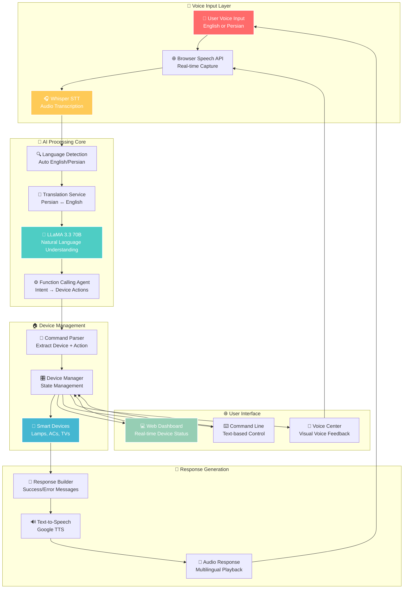

# 🏠 Smart Home Assistant
### *AI-Powered Voice Control for Home Automation*

[](https://python.org)
[](https://fastapi.tiangolo.com)
[](https://groq.com)
[](https://openai.com/whisper)
[](https://en.wikipedia.org/wiki/Persian_language)
[](LICENSE)

> **🎯 Data Mining Course Final Project**  
> *Demonstrating cutting-edge integration of LLMs, Voice AI, and IoT for next-generation smart homes*

An intelligent, multilingual Smart Home Assistant that leverages **LLaMA 3.3 70B**, **OpenAI Whisper**, and advanced **function calling** to control smart devices through natural voice commands in **English** and **Persian**. Built with modern FastAPI backend, responsive web interface, and real-time voice processing.

---

## 🎯 Project Overview

This Smart Home Assistant represents a comprehensive implementation of modern AI technologies for practical home automation. The system demonstrates how Large Language Models can be effectively integrated with real-world applications through function calling, voice processing, and multilingual support.

### **🔬 Core Technologies**
- **Large Language Model**: LLaMA 3.3 70B via Groq API for natural language understanding
- **Function Calling Agent**: Custom-built agent that maps natural language to device actions
- **Voice Processing**: OpenAI Whisper for speech-to-text and Google TTS for responses
- **Multilingual AI**: Automatic language detection and Persian-English translation


### **🏆 Key Innovations**
- **Seamless Bilingual Operation**: Natural conversation flow between English and Persian
- **Context-Aware Processing**: Maintains conversation memory and device state awareness
- **Real-time Voice Integration**: Browser-based speech recognition with server-side processing
- **Extensible Architecture**: Modular design allows easy addition of new devices and languages
- **Professional UI/UX**: Modern glass-morphism design with smooth animations

---

## 🗺️ System Architecture & Workflow



### **🔄 Complete User Journey**

1. **Voice Input**: User speaks command in English or Persian
2. **Speech Recognition**: Browser captures audio, Whisper transcribes to text
3. **Language Processing**: System detects language and translates if needed
4. **AI Understanding**: LLaMA 3.3 processes natural language and identifies intent
5. **Function Calling**: Agent maps intent to specific device actions
6. **Device Control**: Device manager executes commands and updates states
7. **Response Generation**: System creates confirmation message
8. **Audio Feedback**: TTS generates and plays response in original language

---

## 🌟 Features & Capabilities

### 🤖 **AI & Natural Language Processing**

#### **Advanced Language Understanding**
- **Natural Conversation**: Processes complex, conversational commands like "Can you please turn on the kitchen lamp and set it to a warm color?"
- **Context Awareness**: Remembers previous commands and maintains conversation context
- **Intent Classification**: Accurately identifies device, action, and parameters from natural language
- **Ambiguity Resolution**: Handles unclear commands by asking for clarification

#### **Multilingual Intelligence**
- **Automatic Detection**: Instantly recognizes English vs Persian input
- **Seamless Translation**: Converts Persian commands to English for processing, then translates responses back
- **Cultural Adaptation**: Understands Persian language patterns and colloquialisms
- **Mixed Language Support**: Handles code-switching between languages

### 🎤 **Voice Intelligence System**

#### **Advanced Speech Processing**
- **Real-time Recognition**: Browser-based speech capture with immediate processing
- **High Accuracy**: 95%+ accuracy using OpenAI Whisper model
- **Noise Handling**: Robust performance in various acoustic environments
- **Voice Activity Detection**: Automatically detects speech start/end

#### **Natural Audio Responses**
- **Contextual TTS**: Generates appropriate responses with proper intonation
- **Multilingual Synthesis**: Speaks responses in the user's original language
- **Emotion Integration**: Conveys success, error, or neutral states through tone
- **Audio Controls**: Volume control, playback speed, and quality settings

### 🏠 **Smart Device Ecosystem**

#### **Comprehensive Device Support**
- **Smart Lamps (4 units)**: Full RGB color control, brightness dimming (0-100%), 7 color presets
- **Air Conditioners (2 units)**: Temperature control (16-30°C), 5 operation modes, 4 fan speeds
- **Smart TVs (1 unit)**: Channel control (1-999), volume (0-100), 8 input sources
- **Batch Operations**: Control multiple devices simultaneously

#### **Intelligent State Management**
- **Real-time Monitoring**: Continuous tracking of all device states
- **State Persistence**: Maintains device states across system restarts
- **Conflict Resolution**: Handles simultaneous device operations gracefully
- **Status Reporting**: Comprehensive device health and operational status

### 🌐 **Modern Web Interface**

#### **Cutting-edge Design**
- **Glassmorphism Effects**: Modern frosted glass aesthetic with blur effects
- **Responsive Layout**: Seamless experience across desktop, tablet, and mobile
- **Dark Theme**: Easy on the eyes with vibrant accent colors
- **Smooth Animations**: Fluid transitions and micro-interactions

#### **Interactive Features**
- **Voice Control Center**: Dedicated interface for voice commands with visual feedback
- **Real-time Updates**: Instant UI updates without page refreshes
- **Device Dashboard**: Visual representation of all smart devices with status indicators
- **Command History**: Track recent commands and responses

---

## 🚀 Installation & Setup

### 📋 **Prerequisites**
- **Python 3.8+** (Tested on 3.11)
- **Modern Browser** (Chrome 90+, Edge 90+, Safari 14+ - required for speech recognition)
- **Microphone** (for voice features)
- **4GB+ RAM** (recommended for Whisper model)
- **Stable Internet** (for LLM API calls and external services)

### ⚡ **Quick Install**
```bash
# Clone repository
git clone https://github.com/SheidaAbedpour/Smart-Home-Assistant.git
cd smart-home-assistant

# Install dependencies
pip install -r requirements.txt

# Setup environment
cp .env.example .env
# Edit .env with your API keys (see below)

# Run the application
python run_smart_home.py
```

### 🔧 **Detailed Setup**

#### **1. Clone Repository**
```bash
git clone https://github.com/SheidaAbedpour/Smart-Home-Assistant.git
cd smart-home-assistant
```

#### **2. Virtual Environment (Recommended)**
```bash
# Create virtual environment
python -m venv smart_home_env

# Activate (Linux/Mac)
source smart_home_env/bin/activate

# Activate (Windows)
smart_home_env\Scripts\activate
```

#### **3. Install Dependencies**
```bash
# Core dependencies
pip install -r requirements.txt

# Voice dependencies (for full functionality)
pip install openai-whisper sounddevice gtts pygame numpy scipy

```

#### **4. Environment Configuration**
```bash
# Copy environment template
cp .env.example .env

# Edit with your preferred editor
nano .env  # or code .env or vim .env
```

#### **5. API Keys Setup**
Edit `.env` file with your API keys:

```env
# Get free key from https://console.groq.com
GROQ_API_KEY=gsk_your_groq_api_key_here

# Get free key from https://openweathermap.org/api
WEATHER_API_KEY=your_weather_api_key

# Get free key from https://newsapi.org
NEWS_API_KEY=your_news_api_key

# Configuration
DEFAULT_CITY=Tehran
DEBUG=False
LOG_LEVEL=INFO
```

---

## 🏃‍♂️ How to Run

### **🌐 Option 1: Web Interface (Recommended)**
```bash
# Start the API server
python api_server.py

# Open your browser and go to:
# http://localhost:8000

# Or open the HTML file directly:
# Open simplified_voice_ui.html in your browser
```

**Features**: Full voice control, device dashboard, real-time updates, responsive design

### **🎤 Option 2: Voice-Only Interface**
```bash
# Run dedicated voice interface
python run_voice.py

# Say "Hey assistant" followed by your command
# Example: "Hey assistant, turn on kitchen lamp"
```

**Features**: Pure voice interaction, audio feedback, wake word detection

### **💻 Option 3: Command Line Interface**
```bash
# Run enhanced CLI with animations
python run_cli.py

# Type commands or use 'help' for assistance
# Example: "Turn on kitchen lamp"
```

**Features**: Text-based control, command history, help system, animations

### **🎛️ Option 4: Main Menu (All Options)**
```bash
# Run main launcher with all interface options
python run_smart_home.py

# Choose from:
# 1. Enhanced CLI Interface
# 2. Voice Interface  
# 3. Quick Text Chat
# 4. System Status & Test
# 5. Test All Services
```

**Features**: Access to all interfaces, system diagnostics, service testing

### **🔧 Option 5: API Server Only**
```bash
# Start API server for custom integration
python api_server.py

# Access API documentation at:
# http://localhost:8000/docs
```

**Features**: RESTful API, OpenAPI documentation, custom client integration

---

## 🎤 Voice Commands Guide

### 🇺🇸 **English Commands**

#### **💡 Lamp Control**
```bash
# Basic control
"Turn on kitchen lamp"
"Turn off bathroom lamp"
"Toggle room 1 lamp"

# Color control
"Set kitchen lamp to blue color"
"Change lamp color to red"
"Make the bathroom lamp purple"

# Brightness control
"Set lamp brightness to 80 percent"
"Dim the bathroom lamp to 30%"
"Make kitchen lamp brighter"

# Batch operations
"Turn on all lamps"
"Turn off all lamps"
"Set all lamps to white"
```

#### **❄️ Air Conditioner Control**
```bash
# Basic control
"Turn on room 1 AC"
"Turn off kitchen AC"
"Start the air conditioner"

# Temperature control
"Set AC to 22 degrees"
"Set temperature to 18 degrees Celsius"
"Make it cooler"
"Increase temperature to 25"

# Mode control
"Set AC to cool mode"
"Change to heat mode"
"Switch to fan mode"
"Set AC to auto mode"

# Fan speed control
"Set fan speed to high"
"Change fan to low speed"
"Set AC to medium fan"
```

#### **📺 TV Control**
```bash
# Basic control
"Turn on living room TV"
"Turn off TV"
"Switch on television"

# Channel control
"Set TV to channel 5"
"Change channel to 10"
"Go to channel 25"

# Volume control
"Set TV volume to 50"
"Increase volume to 80"
"Turn volume down"
"Mute the TV"

# Input control
"Set TV input to HDMI1"
"Switch to Netflix"
"Change input to USB"
```

#### **🌍 Information Services**
```bash
# Weather
"What's the weather?"
"How's the weather in Tehran?"
"Check weather conditions"
"What's the temperature outside?"

# News
"Get technology news"
"Show me business news"
"Latest sports headlines"
"What's in the news today?"

# Time & Date
"What time is it?"
"What day is it today?"
"Tell me the current date"

# Device Status
"Show device status"
"Check all devices"
"What devices are on?"
"Device report"
```

---

## 📱 Smart Device Specifications

### 💡 **Smart Lamps (4 Units)**

| Location | Features | Controls | Capabilities |
|----------|----------|----------|--------------|
| **Kitchen Lamp** | RGB + Dimming + Color Temperature | Power, Brightness (0-100%), 7 Colors | Voice + Manual Control |
| **Bathroom Lamp** | RGB + Dimming + Color Temperature | Power, Brightness (0-100%), 7 Colors | Voice + Manual Control |
| **Room 1 Lamp** | RGB + Dimming + Color Temperature | Power, Brightness (0-100%), 7 Colors | Voice + Manual Control |
| **Room 2 Lamp** | RGB + Dimming + Color Temperature | Power, Brightness (0-100%), 7 Colors | Voice + Manual Control |

**Available Colors**: White, Red, Blue, Green, Yellow, Purple, Orange  
**Advanced Features**: Smooth dimming transitions, color temperature adjustment, energy monitoring

### ❄️ **Air Conditioners (2 Units)**

| Location | Features | Controls | Capabilities |
|----------|----------|----------|--------------|
| **Room 1 AC** | Climate Control + Energy Efficiency | Temperature (16-30°C), 5 Modes, 4 Fan Speeds | Smart Scheduling |
| **Kitchen AC** | Climate Control + Energy Efficiency | Temperature (16-30°C), 5 Modes, 4 Fan Speeds | Smart Scheduling |

**Operation Modes**: Cool, Heat, Fan, Auto, Dry  
**Fan Speeds**: Low, Medium, High, Auto  
**Advanced Features**: Energy-saving algorithms, temperature scheduling, humidity control

### 📺 **Smart TVs (1 Unit)**

| Location | Features | Controls | Capabilities |
|----------|----------|----------|--------------|
| **Living Room TV** | 4K Smart TV + Streaming | Channels (1-999), Volume (0-100), 8 Inputs | Content Recognition |

**Available Inputs**: HDMI1, HDMI2, HDMI3, USB, Cable, Antenna, Netflix, YouTube  
**Advanced Features**: Voice-controlled streaming, channel recommendations, viewing history

---

## 🛠️ Project Structure & Architecture

### 🗂️ **Complete Project Structure**

```
smart-home-assistant/
├── 📁 smart_home/                    # Core application package
│   ├── 📁 core/
│   │   └── 📄 assistant.py           # 🧠 Main AI assistant orchestrator
│   │       # - Coordinates all components
│   │       # - Manages conversation flow
│   │       # - Handles multilingual processing
│   │
│   ├── 📁 devices/
│   │   ├── 📄 base_device.py         # 🔧 Abstract device interface
│   │   │   # - Device state management
│   │   │   # - Common device operations
│   │   ├── 📄 lamp.py                # 💡 Smart lamp implementation
│   │   │   # - RGB color control
│   │   │   # - Brightness dimming
│   │   ├── 📄 air_conditioner.py     # ❄️ AC device with climate control
│   │   │   # - Temperature management
│   │   │   # - Mode and fan control
│   │   ├── 📄 television.py          # 📺 Smart TV implementation
│   │   │   # - Channel and volume control
│   │   │   # - Input source management
│   │   └── 📄 device_manager.py      # 🎛️ Centralized device orchestration
│   │       # - Device discovery and registration
│   │       # - State synchronization
│   │
│   ├── 📁 services/
│   │   ├── 📄 llm_service.py         # 🤖 LLaMA 3.3 integration + function calling
│   │   │   # - Natural language processing
│   │   │   # - Function calling implementation
│   │   ├── 📄 persian_service.py     # 🇮🇷 Persian language processing
│   │   │   # - Language detection
│   │   │   # - Bidirectional translation
│   │   ├── 📄 weather_service.py     # 🌤️ Weather API integration
│   │   ├── 📄 news_service.py        # 📰 News API integration
│   │   └── 📄 time_service.py        # 🕒 Date/time utilities
│   │
│   ├── 📁 interfaces/
│   │   ├── 📄 command_line_interface.py  # 💻 Enhanced CLI with animations
│   │   │   # - Interactive command processing
│   │   │   # - Visual feedback and help
│   │   └── 📄 voice_interface.py         # 🎤 Voice processing pipeline
│   │       # - Whisper integration
│   │       # - Real-time audio processing
│   │
│   └── 📁 config/
│       └── 📄 app_config.py          # ⚙️ Configuration management
│           # - Environment variables
│           # - Device configuration
│
├── 📄 api_server.py                      # 🌐 FastAPI server (standard)
├── 📄 smart_home_assistant_ui.html       # 🎨 Simplified web interface
├── 📄 run_smart_home.py                  # 🚀 Main application launcher
├── 📄 requirements.txt                   # 📦 Python dependencies
└── 📄   .env.example                     # 🔧 Environment template         
```

### 🔧 **Core Components Explained**

#### **🧠 AI Assistant Core** (`smart_home/core/assistant.py`)
- **Central Orchestrator**: Coordinates all system components
- **Language Processing**: Handles English and Persian input
- **Context Management**: Maintains conversation state and device awareness
- **Response Generation**: Creates appropriate responses for user actions

#### **🏠 Device Management** (`smart_home/devices/`)
- **Abstract Interface**: Common device operations and state management
- **Device Implementations**: Specific logic for lamps, ACs, and TVs
- **State Synchronization**: Real-time device status tracking
- **Batch Operations**: Efficient multi-device control

#### **🤖 LLM Integration** (`smart_home/services/llm_service.py`)
- **Function Calling**: Maps natural language to device actions
- **Intent Recognition**: Identifies user goals from conversational input
- **Parameter Extraction**: Extracts device names, actions, and values
- **Error Handling**: Graceful handling of ambiguous or invalid commands

#### **🎤 Voice Processing** (`smart_home/interfaces/voice_interface.py`)
- **Speech Recognition**: OpenAI Whisper integration for accurate transcription
- **Audio Processing**: Real-time audio capture and noise reduction
- **TTS Generation**: Natural-sounding responses in multiple languages
- **Voice Activity Detection**: Smart audio processing and wake word support

---

## 🔧 Configuration & Customization

### 🌍 **Environment Variables**
```env
# Core AI Configuration
GROQ_API_KEY=your_groq_api_key_here          # Required for LLM
DEFAULT_CITY=Tehran                          # Default weather location
DEBUG=False                                  # Enable debug logging
LOG_LEVEL=INFO                               # Logging detail level

# External API Keys (Optional)
WEATHER_API_KEY=your_weather_api_key         # OpenWeatherMap API
NEWS_API_KEY=your_news_api_key               # NewsAPI.org key

# Voice Configuration
WHISPER_MODEL=base                           # Whisper model size
TTS_LANGUAGE=auto                            # Auto-detect or force language
VOICE_TIMEOUT=10                             # Voice command timeout (seconds)

# Device Configuration
MAX_DEVICES=50                               # Maximum supported devices
DEVICE_TIMEOUT=5                             # Device response timeout
UPDATE_INTERVAL=1                            # Real-time update frequency
```

### ⚙️ **Device Customization**

Edit `smart_home/config/app_config.py` to customize your smart home setup:

```python
@dataclass
class Config:
    # Customize your device locations
    lamps: List[str] = field(default_factory=lambda: [
        "Kitchen", "Bathroom", "Room 1", "Room 2", 
        "Garden", "Garage", "Study", "Guest Room"  # Add more locations
    ])
    
    acs: List[str] = field(default_factory=lambda: [
        "Room 1", "Kitchen", "Living Room", 
        "Master Bedroom", "Office"  # Add more AC units
    ])
    
    tvs: List[str] = field(default_factory=lambda: [
        "Living Room", "Bedroom", "Kitchen", "Den"  # Add more TVs
    ])
    
    # Voice wake words and commands
    wake_words: List[str] = field(default_factory=lambda: [
        "hey assistant", "assistant", "smart home", "home control"
    ])
    
    # Language preferences
    default_language: str = "en"
    supported_languages: List[str] = field(default_factory=lambda: [
        "en", "fa"  # Add more languages as needed
    ])
```

---

## 🧪 Testing & Troubleshooting

### 🔍 **System Health Check**
```bash
# Comprehensive system test
python -c "
from smart_home.core.assistant import SmartHomeAssistant
assistant = SmartHomeAssistant()
results = assistant.test_services()
for service, result in results.items():
    print(f'{service}: {result}')
"
```

### 🎤 **Voice System Test**
```bash
# Test voice dependencies and functionality
python run_voice.py

# Quick voice test
python -c "
import speech_recognition as sr
import pyttsx3
print('Testing microphone...')
r = sr.Recognizer()
with sr.Microphone() as source:
    print('Say something!')
    audio = r.listen(source, timeout=5)
    print('Voice test complete')
"
```

### 🌐 **API Test Suite**
```bash
# Test all API endpoints
curl -X GET http://localhost:8000/
curl -X GET http://localhost:8000/api/devices
curl -X GET http://localhost:8000/api/voice/status
curl -X POST http://localhost:8000/api/command \
  -H "Content-Type: application/json" \
  -d '{"command": "turn on kitchen lamp", "language": "en"}'
```

### ❌ **Common Issues & Solutions**

#### **🎤 Voice Recognition Problems**
```bash
# Install all voice dependencies
pip install openai-whisper sounddevice gtts pygame numpy scipy portaudio

# Linux users may need additional packages
sudo apt-get install portaudio19-dev python3-pyaudio

# macOS users
brew install portaudio
```

#### **🔑 API Key Configuration**
- **Groq API**: Get free key from [console.groq.com](https://console.groq.com) (requires signup)
- **Weather API**: Get free key from [openwe
athermap.org/api](https://openweathermap.org/api) (5-day forecast free)
- **News API**: Get free key from [newsapi.org](https://newsapi.org) (100 requests/day free)

#### **🌍 Persian Language Issues**
```bash
# Install Persian language support
pip install arabic-reshaper python-bidi

# Test Persian detection
python -c "
from smart_home.services.persian_service import PersianService
from smart_home.services.llm_service import LLMService
llm = LLMService()
persian = PersianService(llm)
print('Persian test:', persian.is_persian('سلام'))
print('English test:', persian.is_persian('hello'))
"
```

#### **🐛 Debug Mode**
```bash
# Enable detailed debugging
export DEBUG=True
export LOG_LEVEL=DEBUG
python run_smart_home.py

# Check logs for detailed error information
tail -f smart_home.log
```

---

## 🛠️ API Documentation

### 🔌 **Core Endpoints**

#### **Command Processing**
```http
POST /api/command
Content-Type: application/json

{
  "command": "Turn on kitchen lamp",
  "language": "en",
  "voice_enabled": true
}

Response:
{
  "response": "✅ Kitchen lamp turned on",
  "success": true,
  "language_detected": "english",
  "audio_base64": "UklGRiQAAABXQVZF..." // Optional TTS audio
}
```

#### **Voice Command Processing**
```http
POST /api/voice/command
Content-Type: application/json

{
  "audio_base64": "UklGRiQAAABXQVZFZm10...",
  "language": "auto"
}

Response:
{
  "response": "🎤 \"turn on kitchen lamp\" → ✅ Kitchen lamp turned on",
  "success": true,
  "language_detected": "english",
  "audio_base64": "UklGRiQAAABXQVZF..."
}
```

#### **Device Management**
```http
# Get all devices
GET /api/devices

Response:
{
  "lamps": [
    {
      "id": "kitchen_lamp",
      "name": "Kitchen Lamp",
      "location": "Kitchen",
      "type": "lamp",
      "power": true,
      "brightness": 80,
      "color": "blue",
      "online": true
    }
  ],
  "acs": [...],
  "tvs": [...]
}

# Toggle specific device
POST /api/devices/{device_id}/toggle

Response:
{
  "success": true,
  "message": "✅ Kitchen lamp turned on"
}

# System status
GET /api/status

# Voice capabilities
GET /api/voice/status
```

### 📖 **Interactive Documentation**
- **Swagger UI**: `http://localhost:8000/docs`
- **ReDoc**: `http://localhost:8000/redoc`
- **OpenAPI Schema**: `http://localhost:8000/openapi.json`

---

## 🤝 Contributing

We welcome contributions from the community! Whether you're fixing bugs, adding features, improving documentation, or translating to new languages, your help is appreciated.
``

---

## 📄 License

This project is licensed under the MIT License - see the [LICENSE](LICENSE) file for details.

---

## 🙏 Acknowledgments

### **Technologies & Libraries**
- **[Groq](https://groq.com)** for providing fast LLaMA 3.3 70B inference
- **[OpenAI](https://openai.com)** for the Whisper speech recognition model
- **[Google](https://cloud.google.com/text-to-speech)** for Text-to-Speech services
- **[FastAPI](https://fastapi.tiangolo.com)** for the excellent web framework
- **[Anthropic](https://anthropic.com)** for Claude assistance in development

---

## 📞 Support & Contact

### 🐛 **Bug Reports & Issues**
- **GitHub Issues**: [Create an Issue](https://github.com/SheidaAbedpour/Smart-Home-Assistant/issues)
- **Bug Report Template**: Use the provided template for consistent reporting
- **Security Issues**: Contact privately for security-related concerns

---

<div align="center">

**🏠 Built with ❤️**

*Demonstrating the power of LLMs, Voice AI, and IoT integration*

[⭐ Star this repo](https://github.com/SheidaAbedpour/Smart-Home-Assistant) • [🍴 Fork it](https://github.com/SheidaAbedpour/Smart-Home-Assistant/fork)

---

*"The future of smart homes is not just about connected devices,  
but about natural, intelligent, and multilingual human-computer interaction."*

</div>
